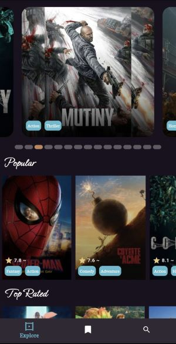
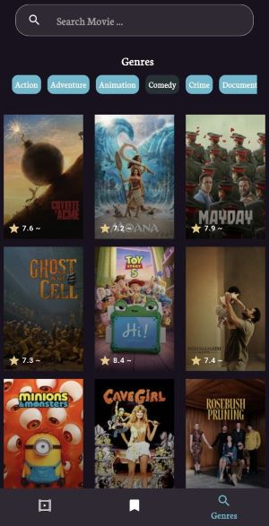

# Movie Explorer
A Flutter movie discovery app that allows users to explore movies, watch trailers, view ratings, cast and production companies, search by title or genre, and save movies to a personal watch list.

## Features 
- Browse and explore movies
- View detailed movie information
- View movie ratings
- Watch movie trailers
- View cast and production companies
- Search for movies by title
- Filter movies by genre
- Add and remove movies from the Watch List
- Share movies
- Store the Watch List locally

## Project Highlights

- Built with Flutter using reusable custom widgets
- Integrated a movie REST API
- Implemented local data persistence using Hive
- Implemented nested navigation for different app sections
- Used FutureBuilder to handle asynchronous API requests
- Implemented movie search and genre filtering
- Added a persistent Watch List

## Used technology
- Flutter & Dart
- REST API
- HTTP Package
- Hive & Hive Flutter for local storage
- JSON
- FutureBuilder for asynchronous data handling


## Requirements
- Flutter SDK
- Internet connection
- TMDB API Key

## How to run
1. Clone the repository.
2. Install the required dependencies:
   ```bash
   flutter pub get
3. Create your own TMDB API key.
4. Add the API key to the project.
5. Run the application : 
    ```bash
    flutter run

## Screenshots





## Data Source
Movie data and images are provided by [TMDB](https://www.themoviedb.org/).

